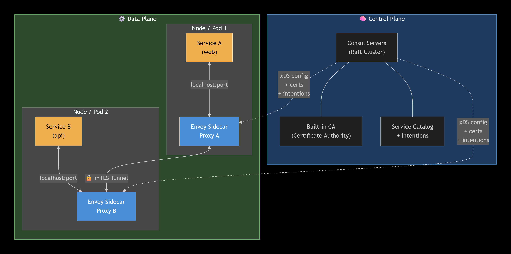
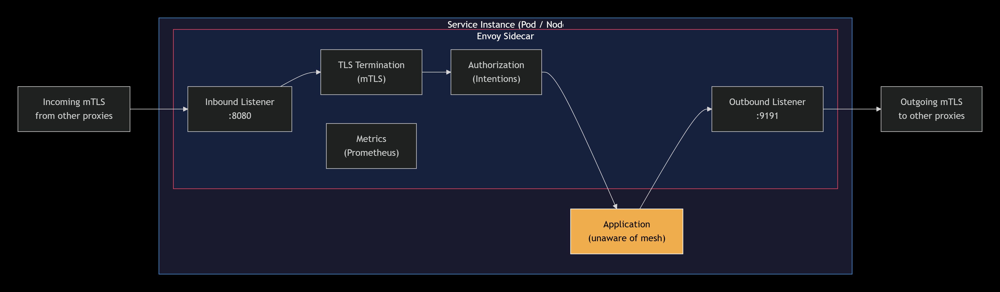
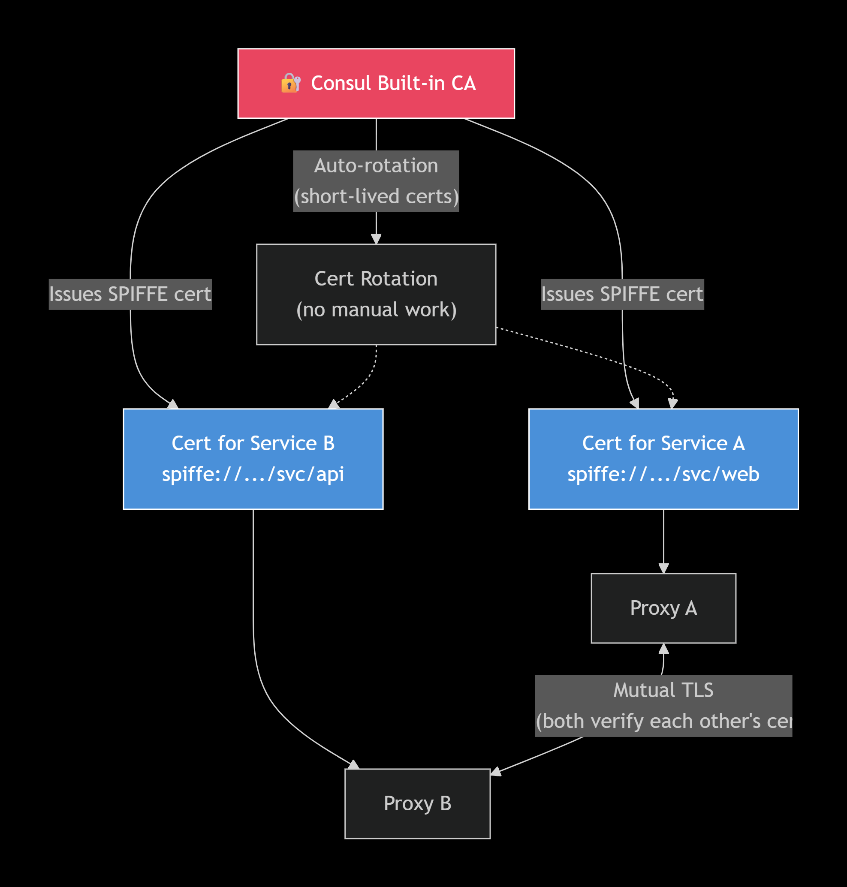
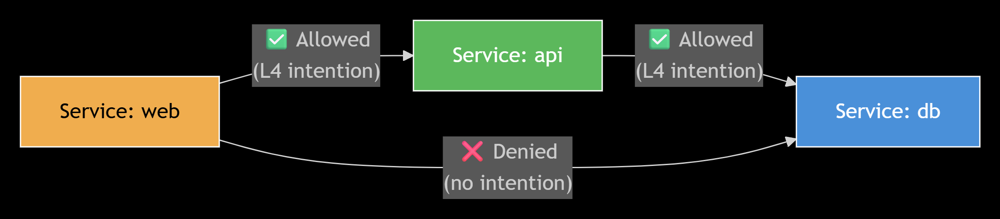
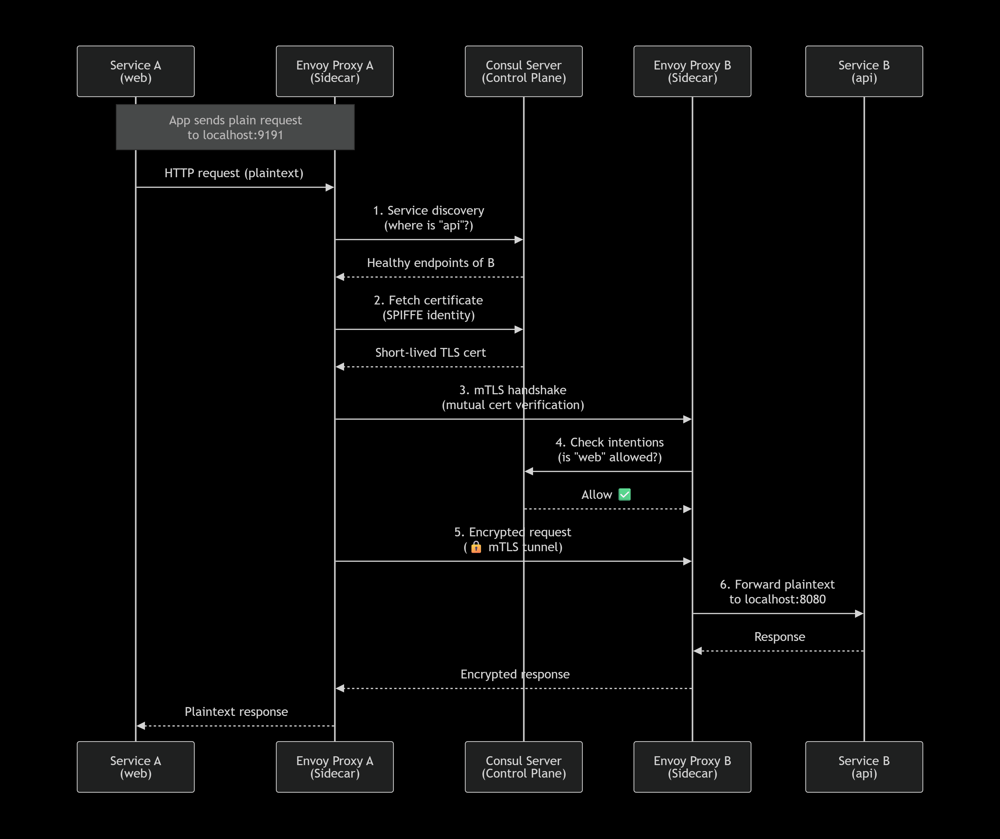
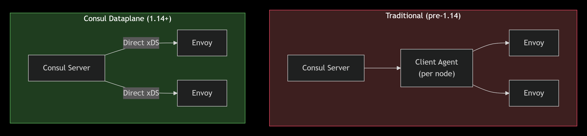
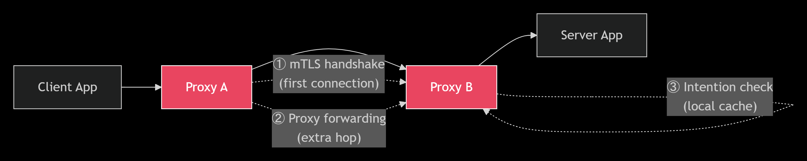

# Consul Service Mesh — Research & Performance Testing

A hands-on evaluation of HashiCorp Consul Connect (service mesh) for microservices communication — covering architecture research, deployment, benchmarking, failover behavior, and security analysis.

**Repository:** https://github.com/ThanushaBai/consul-service-mesh

---

## Table of Contents

- [Overview](#overview)
- [Architecture](#architecture)
- [Repository Structure](#repository-structure)
- [Environments](#environments)
- [Deliverables](#deliverables)
- [Key Findings](#key-findings)
- [Getting Started](#getting-started)
- [Prerequisites](#prerequisites)
- [License](#license)

---

## Overview

This project evaluates Consul Connect as a service mesh for microservice-to-microservice communication. It covers the complete lifecycle: research, deployment, benchmarking, failover testing, and security analysis.

**Parent Task:** DEV-610 — Consul Service Mesh

**Subtasks completed:**

| Subtask | Title |
|---------|-------|
| DEV-611 | Research Consul Connect Architecture |
| DEV-612 | Deploy Test Application With and Without Consul Connect |
| DEV-613/614 | Benchmark Latency & Resource Overhead |
| DEV-615 | Test Failover and Load Balancing |
| DEV-616 | Document Security Benefits |
| DEV-617 | Create Performance Comparison Report |
| DEV-618 | Provide Recommendation |

---

## Architecture

### High-Level: Control Plane + Data Plane

Consul Connect follows the classic control plane / data plane separation:

- **Control plane** — Consul servers handle service discovery, certificate issuance, and intention management.
- **Data plane** — Envoy sidecar proxies handle traffic forwarding, TLS termination, and authorization enforcement.



### Sidecar Proxy (Inbound & Outbound)

Every service instance has an Envoy sidecar that intercepts all inbound and outbound traffic. The application itself is unaware of the mesh.



### Certificate & Identity Flow

Consul's built-in CA issues short-lived SPIFFE certificates to every service instance. All service-to-service traffic is mTLS-encrypted.



### Intention Enforcement

Intentions are authorization rules enforced by the sidecar proxies. They define which service can talk to which, at either L4 (connection) or L7 (request) level.



### Traffic Flow (mTLS Path)

A request from one service to another traverses: app → local sidecar → remote sidecar → remote app. All inter-sidecar traffic is encrypted.



### Traditional vs. Consul Dataplane (v1.14+)

Consul 1.14 removed the node-level client agent requirement for dataplane deployments, reducing client-side resource consumption.



### Latency Overhead Sources

The mesh introduces overhead from three sources: mTLS handshake, proxy forwarding, and intention checks.



---

## Repository Structure

```
consul-service-mesh/
├── README.md
├── docs/                              # Reports for each subtask
│   ├── 01-architecture-research.md
│   ├── 02-deployment-setup.md
│   ├── 03-benchmark-results.md
│   ├── 04-failover-and-loadbalancing.md
│   ├── 05-security-benefits.md
│   ├── 06-performance-comparison.md
│   ├── 07-recommendation.md
│   └── screenshots/                   # Consul UI evidence
├── diagrams/                          # Architecture visuals
├── deployment/
│   ├── app/                           # Python/Flask test application
│   │   ├── backend/
│   │   └── frontend/
│   ├── baseline/                      # Direct HTTP (no mesh)
│   │   └── docker-compose.yml
│   └── with-mesh/                     # Consul + Envoy sidecars
│       ├── docker-compose.yml
│       ├── consul-config/             # HCL configs (server, agents, services)
│       └── sidecar/                   # Custom sidecar image (Envoy + Consul CLI)
└── benchmarks/
    ├── scripts/
    │   ├── benchmark.js               # k6 load-test script
    │   └── output/                    # HTML reports
    └── results/                       # Raw results (hey + k6 + stats)
```

---

## Environments

### Baseline (No Mesh)

Two Python/Flask services on a Docker bridge network. The frontend calls the backend directly over plain HTTP.

| Component | Description |
|-----------|-------------|
| `baseline-backend` | Backend API (port 8080) |
| `baseline-frontend` | Frontend (port 8081 → calls backend) |

**No proxy, no encryption, no authorization.**

### With Mesh (Consul Connect)

Each service runs as a group of three containers sharing one network namespace (Kubernetes "pod" pattern):

- **Agent container** — owns the namespace, runs Consul client
- **App container** — the Python service
- **Sidecar container** — Envoy proxy

Plus one central Consul server.

| Group | Containers |
|-------|-----------|
| Consul server | `consul-server` |
| Backend replica 1 | `mesh-backend-agent-1`, `mesh-backend-1`, `mesh-backend-sidecar-1` |
| Backend replica 2 | `mesh-backend-agent-2`, `mesh-backend-2`, `mesh-backend-sidecar-2` |
| Backend replica 3 | `mesh-backend-agent-3`, `mesh-backend-3`, `mesh-backend-sidecar-3` |
| Frontend | `mesh-frontend-agent`, `mesh-frontend`, `mesh-frontend-sidecar` |

**Total: 13 containers.**

---

## Deliverables

All reports are in the `docs/` folder:

| # | Report | Description |
|---|--------|-------------|
| 01 | [Architecture Research](docs/01-architecture-research.md) | Consul Connect architecture, components, traffic flow |
| 02 | [Deployment Setup](docs/02-deployment-setup.md) | Baseline and mesh environments, verification evidence |
| 03 | [Benchmark Results](docs/03-benchmark-results.md) | Latency, throughput, CPU, memory comparison |
| 04 | [Failover & Load Balancing](docs/04-failover-and-loadbalancing.md) | 4-phase test: balancing, pod kill, intention deny, health-check failover |
| 05 | [Security Benefits](docs/05-security-benefits.md) | mTLS, SPIFFE identity, intentions, zero-trust |
| 06 | [Performance Comparison](docs/06-performance-comparison.md) | Consolidated trade-off analysis |
| 07 | [Recommendation](docs/07-recommendation.md) | When to adopt a service mesh (and when not to) |

---

## Key Findings

### Performance Overhead (Measured)

| Metric | Baseline | Mesh | Delta |
|--------|----------|------|-------|
| Average latency (k6) | 162 ms | 184 ms | **+13.5%** |
| Average latency (hey) | 277 ms | 295 ms | **+6.5%** |
| Throughput | 143 req/s | 132 req/s | **-7.6%** |
| Aggregate CPU | ~15% | ~230% | **~15×** |
| Aggregate memory | ~101 MiB | ~250 MiB | **~2.5×** |

### Failover Behavior (Measured)

| Scenario | Result |
|----------|--------|
| Pod kill (agent + app + sidecar) | **0 errors** — instant failover |
| App-only kill (health-check path) | **1.45% errors** during 10–15s detection window |
| Recovered replica | Automatic rejoin, no client changes |
| Deny intention | Instant block, no restart |

### Security Capabilities (Demonstrated)

- **Automatic mTLS** — every service-to-service request is encrypted
- **SPIFFE identity** — each service has a cryptographic identity
- **Intention-based authorization** — allow/deny enforced at the data plane
- **Zero-trust posture** — no implicit trust based on network location

---

## Getting Started

### Run the Baseline

```bash
cd deployment/baseline
docker compose up -d
curl http://localhost:8081/
```

### Run the Mesh

```bash
cd deployment/with-mesh
docker compose up -d

# Wait ~60 seconds for all sidecars to boot

# Add the authorization intention
docker exec consul-server consul intention create frontend backend

# Test through the mesh
curl http://localhost:8081/
```

### Open the Consul UI

```
http://localhost:8500
```

- **Services** — all registered services and their sidecars
- **Intentions** — authorization rules
- **Nodes** — cluster membership

### Run Benchmarks

```bash
# Quick load test (hey)
docker run --rm --network host williamyeh/hey -z 60s -c 50 http://localhost:8081/

# Comprehensive load test (k6)
docker run --rm -i --network host \
  -e TARGET_URL=http://localhost:8081/ \
  -v "$(pwd)/benchmarks:/benchmarks" \
  grafana/k6 run /benchmarks/scripts/benchmark.js
```

### Stop Everything

```bash
cd deployment/baseline && docker compose down
cd ../with-mesh && docker compose down
```

---

## Prerequisites

- **Docker Desktop** (v24+ recommended)
- **Docker Compose** (v2, bundled with Docker Desktop)
- **Python 3.12** (optional — for local dev of the test app)
- **8 GB RAM** minimum for the full 13-container mesh environment
- **Ports required:** 8080, 8081, 8500, 9191

---

## Technology Stack

| Component | Version |
|-----------|---------|
| Consul | 1.18.2 |
| Envoy | 1.28 |
| Python | 3.12 |
| Flask | 3.0.3 |
| k6 | latest |
| hey | latest |

---

## License

Internal research project. Not for public distribution.

---

## Acknowledgments

Built as part of the DevOps internship program under the parent task **DEV-610 — Consul Service Mesh**.

---

*End of README*