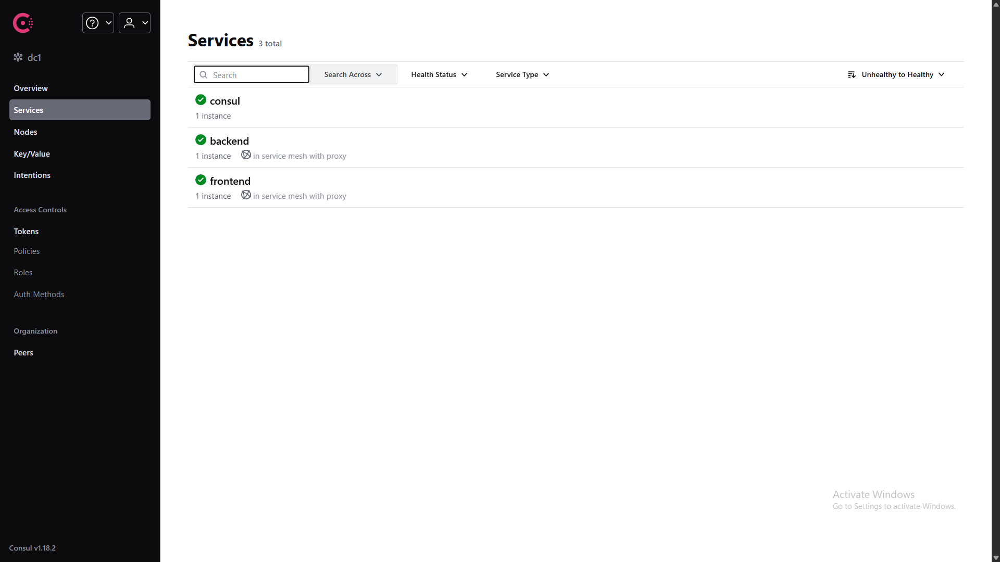
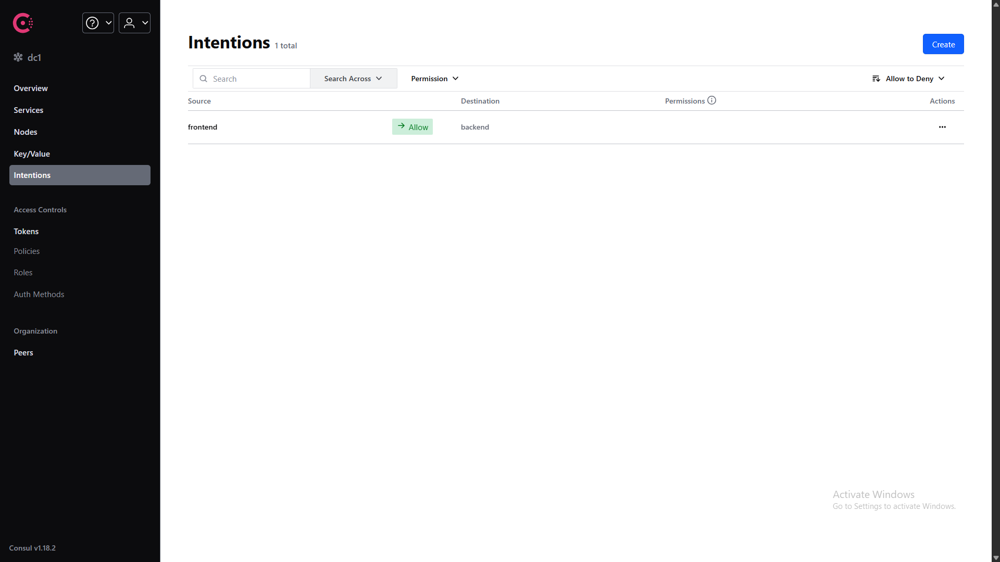
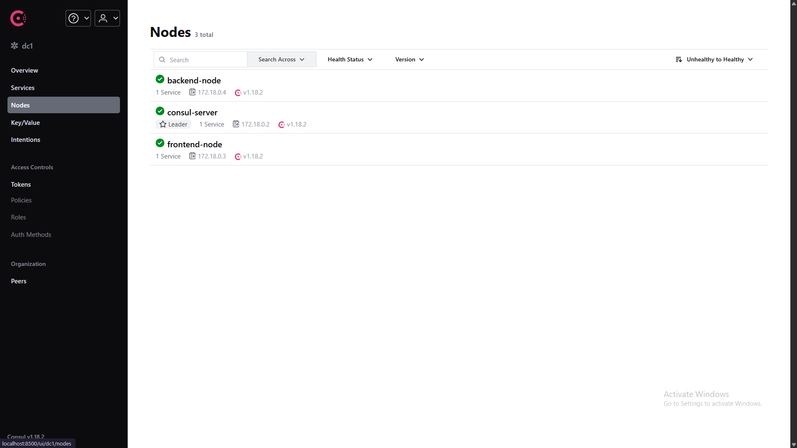
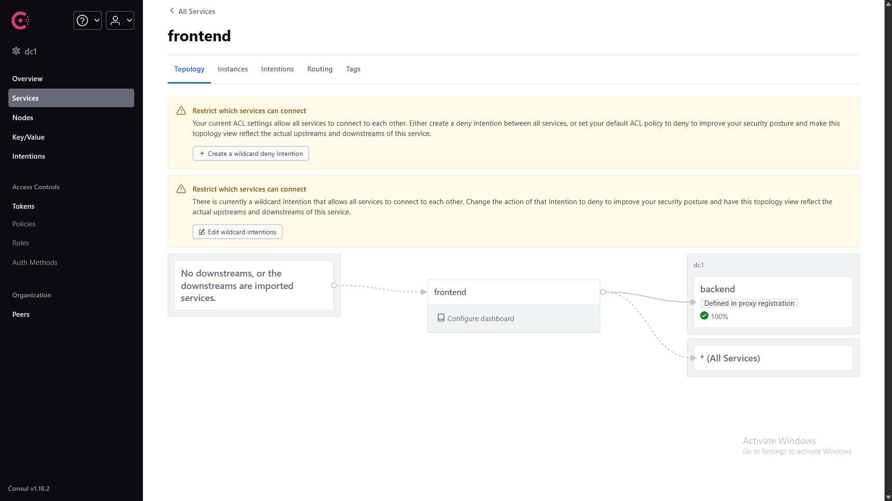
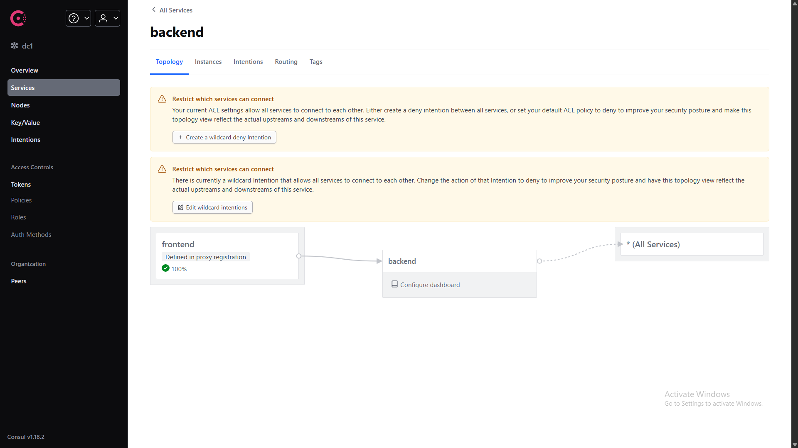
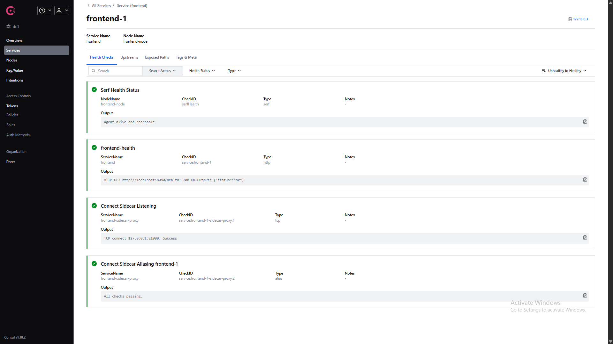
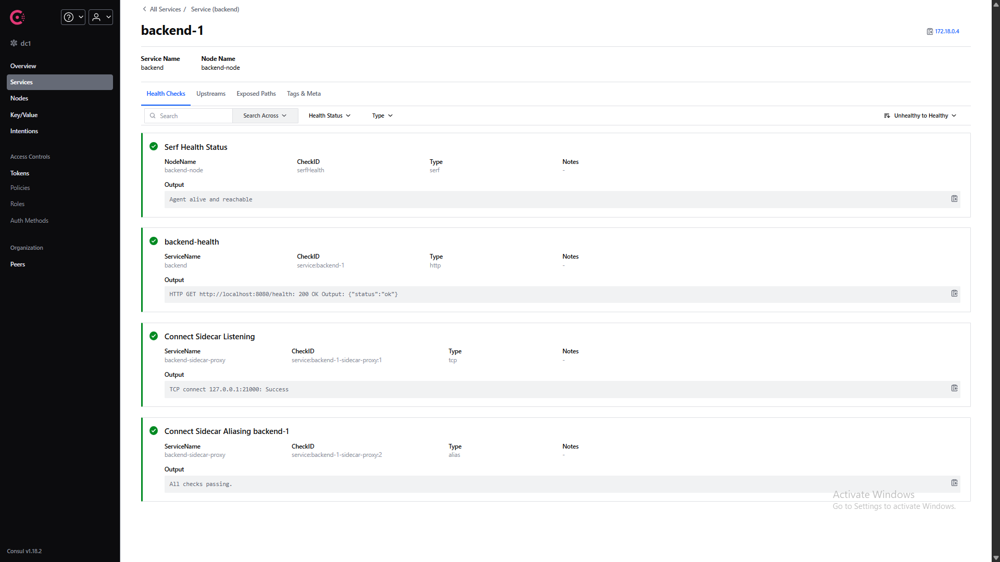

# Consul Service Mesh — Deployment Setup

| Field | Value |
|---|---|
| **Department** | DevOps |
| **Prepared by** | Thanusha Bai V |
| **Date** | 02-Oct-2026 |
| **Subtask** | DEV-612 — Deploy Test Application With and Without Consul Connect |
| **Parent Task** | DEV-610 — Consul Service Mesh |

---

## 1. Overview

This document covers the deployment of a two-service Python/Flask microservice application in two parallel environments — a **baseline** setup (direct HTTP, no proxy) and a **with-mesh** setup (Consul Connect + Envoy sidecars with mTLS). Both environments run the identical application, differing only by the presence of the service mesh, so that performance and behavior can be compared later in DEV-613/614.

The deployment validates the architecture described in DEV-611 (`01-architecture-research.md`) by proving that:

- Services self-register with a Consul control plane
- Envoy sidecars enforce mTLS between services
- Intentions authorize service-to-service communication
- End-to-end requests succeed through the encrypted mesh

---

## 2. Test Application

A minimal two-service application written in Python 3.12 using Flask:

| Service | Role | Port | Endpoint |
|---------|------|------|----------|
| `frontend` | Calls backend and returns combined response | 8080 | `GET /` |
| `backend` | Returns JSON payload | 8080 | `GET /api` |

Both services expose `GET /health` for Consul health checks.

**Source location:** `deployment/app/`

---

## 3. Baseline Environment

### 3.1 Purpose

Provides a control group for benchmarking — services communicate over plain HTTP with no proxy, no encryption, and no service mesh overhead.

### 3.2 Architecture

Two containers on a single Docker bridge network. The frontend reaches the backend directly by container DNS name.

### 3.3 Location

`deployment/baseline/docker-compose.yml`

### 3.4 Run

```bash
cd deployment/baseline
docker compose up -d
```

### 3.5 Test

```bash
curl http://localhost:8081/
```

**Expected:**

```json
{
  "backend_response": {"message": "Hello from the backend!"},
  "backend_url_used": "http://backend:8080",
  "service": "frontend",
  "timestamp": "..."
}
```

### 3.6 Stop

```bash
docker compose down
```

---

## 4. With-Mesh Environment

### 4.1 Purpose

Provides the test subject — the same application wrapped in a Consul Connect service mesh, with automatic mTLS and intention-based authorization.

### 4.2 Architecture

Each service runs as a group of three containers sharing a single network namespace (the Kubernetes "pod" pattern):

- **Agent container** — runs the Consul client agent, owns the network namespace
- **App container** — the Python service, shares the agent's namespace
- **Sidecar container** — runs Envoy, shares the agent's namespace

Plus one **Consul server** container acting as the central control plane.

### 4.3 Location

`deployment/with-mesh/docker-compose.yml`

### 4.4 Run

```bash
cd deployment/with-mesh
docker compose up -d
```

Wait ~60 seconds for all agents to join and sidecars to register.

Add the authorization intention:

```bash
docker exec consul-server consul intention create frontend backend
```

### 4.5 Test

```bash
docker exec mesh-frontend python -c "import urllib.request; print(urllib.request.urlopen('http://localhost:9191/api').read().decode())"
```

**Expected:**

```json
{"message":"Hello from the backend!","service":"backend","timestamp":"..."}
```

### 4.6 Stop

```bash
docker compose down
```

---

## 5. Configuration Files

### 5.1 Consul Server

**`consul-config/server.hcl`** — configures the central control plane:

- Single-server bootstrap (`bootstrap_expect = 1`)
- Binds all services (HTTP, gRPC, gossip) to `0.0.0.0`
- Enables Connect (service mesh) and the Web UI

### 5.2 Consul Agents

**`consul-config/agent-backend.hcl`** and **`agent-frontend.hcl`** — configure each client agent:

- Binds HTTP and gRPC to `0.0.0.0`
- Enables Connect
- Joins the central server via `-retry-join`

### 5.3 Service Registrations

**`consul-config/backend-service.hcl`** — registers the backend service with:

- A sidecar proxy declaration (`connect.sidecar_service {}`)
- An HTTP health check on `/health`

**`consul-config/frontend-service.hcl`** — registers the frontend service with:

- A sidecar proxy declaration
- An upstream binding to `backend` on `local_bind_port = 9191`
- An HTTP health check on `/health`

### 5.4 Sidecar Image

**`sidecar/Dockerfile`** — custom image based on `envoyproxy/envoy:v1.28-latest`:

- Adds the Consul CLI (`consul` binary, v1.18.2)
- Adds `wget` for the startup wait-loop
- Both binaries verified at build time

---

## 6. Verification Evidence

### 6.1 Service Registration



All four services (backend, frontend, and their sidecar proxies) registered with green health checks.

### 6.2 Intentions



Explicit rule: `frontend → backend: Allow`.

### 6.3 Nodes



Three nodes alive: `consul-server`, `backend-node`, `frontend-node`.

### 6.4 Frontend Topology



Frontend's upstream binding to backend is defined and healthy.

### 6.5 Backend Topology



Backend receiving traffic from frontend's sidecar.

### 6.6 Frontend Health Checks



Four checks passing, including "Connect Sidecar Listening" on `127.0.0.1:21000`.

### 6.7 Backend Health Checks



Same set of checks passing on the backend side.

### 6.8 End-to-End Test

Successful mTLS-encrypted request through the full mesh path:

```json
{"message":"Hello from the backend!","service":"backend","timestamp":"2026-10-01T18:33:37.531951"}
```

---

## 7. Challenges Encountered

Several issues were diagnosed and resolved during deployment — documented here for future reference:

| Issue | Resolution |
|-------|-----------|
| Consul `-dev` mode did not bind gossip ports to the network | Replaced with explicit `server.hcl` config binding all ports to `0.0.0.0` |
| Sidecars exited — `envoy` binary not found in `hashicorp/consul` image | Built a custom sidecar image from `envoyproxy/envoy` + Consul CLI |
| Envoy 1.29 rejected by Consul 1.18 | Downgraded sidecar base image to Envoy 1.28 |
| Sidecars started before their agent HTTP was ready | Added a `wget` wait-loop checking `/v1/status/leader` |
| App could not reach sidecar on `localhost:9191` | Restructured so app + sidecar share the agent's network namespace |
| Service registered with agent's IP, not app's IP | Same restructure — resolves IP mismatch |

---

## 8. Link to Subsequent Subtasks

This deployment provides the foundation for:

| Subtask | What it builds on from this doc |
|---------|--------------------------------|
| **DEV-613/614** | Benchmark both environments for latency, CPU, and memory (baseline vs mesh) |
| **DEV-615** | Test failover and load balancing using the mesh intention mechanism |
| **DEV-616** | Document mTLS and identity-based security benefits observed in the mesh |

---

## 9. Conclusion

Both environments are deployed, verified, and operational. The baseline provides a plain-HTTP control group; the with-mesh environment demonstrates working mTLS-encrypted communication between services with intention-based authorization.

All verification evidence is captured in the screenshots and the successful end-to-end test. The deployment is ready for performance benchmarking under DEV-613/614.

---

*End of Report*